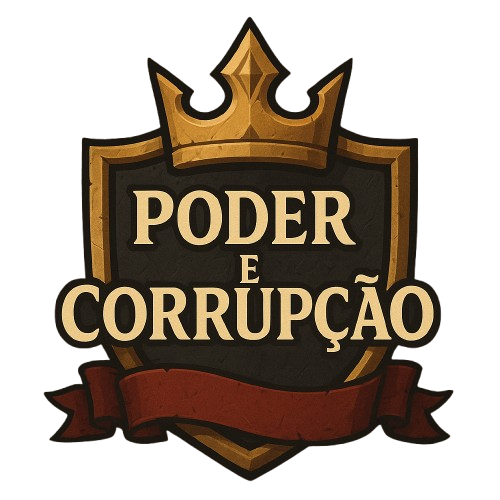

  

<h1 align="center">Poder e Corrupção</h1>

Poder e corrupção é um jogo onde o jogador assume o papel de um rei que deve proteger seu reino contra ataques externos e ameaças internas, incluindo um traidor infiltrado entre seus aliados. O jogo mistura a estratégia de um Tower Defense com a imersão narrativa de um RPG de escolhas , onde cada decisão impacta no destino do reino.

Durante o jogo, o jogador precisa equilibrar a lealdade de seu exército, a opinião do povo e os recursos do reino, enquanto decide como lidar com crises, invasões e conspirações dentro do castelo.

Suas ações influenciam diretamente o futuro do trono: um governante justo pode trazer prosperidade e paz, enquanto um rei autoritário pode mergulhar o reino na corrupção e no medo.

