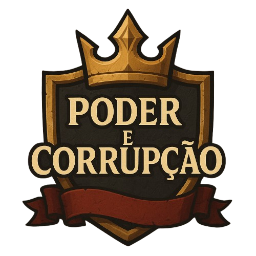

  

<h1 align="center">Poder e Corrupção</h1>

Poder e corrupção é um jogo onde o jogador assume o papel de um rei que deve proteger seu reino contra ataques externos e ameaças internas, incluindo uma possível traição de seu povo. O jogo mistura a estratégia de um Tower Defense com a imersão narrativa de um RPG de escolhas , onde a decisão de onde e quanto investir pode acabar com seu reinado.

Durante o jogo, o jogador precisa equilibrar seus gastos dividindo-os em investimentos pro reino e pras suas defesas, enquanto decide como lidar com crises e invasões dentro do castelo.

Suas ações influenciam diretamente o futuro do trono: um governante justo pode trazer prosperidade e paz, enquanto um rei autoritário pode mergulhar o reino na corrupção e no medo.

